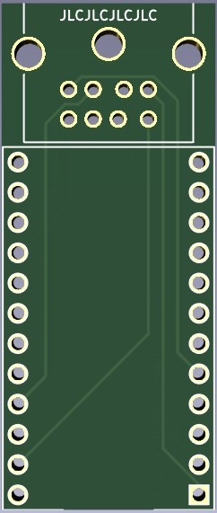
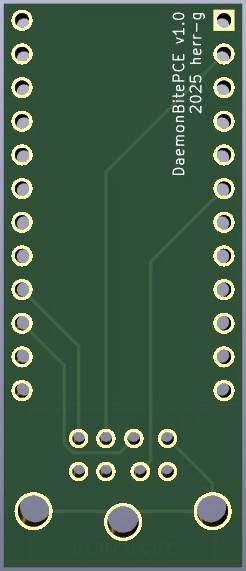
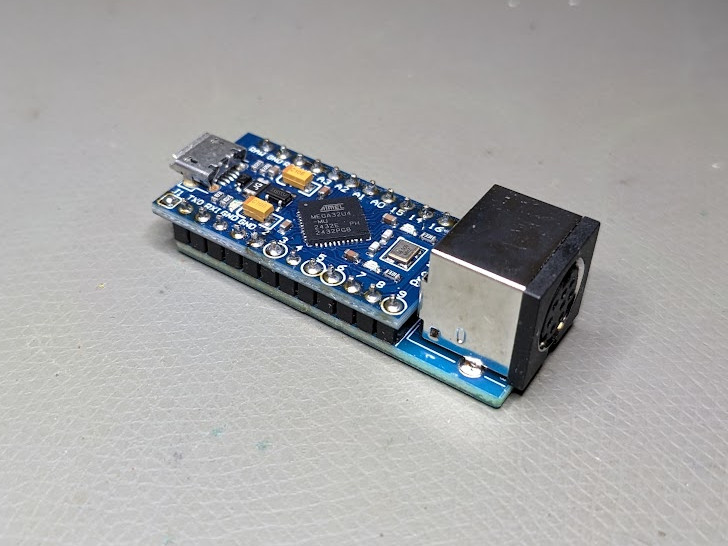
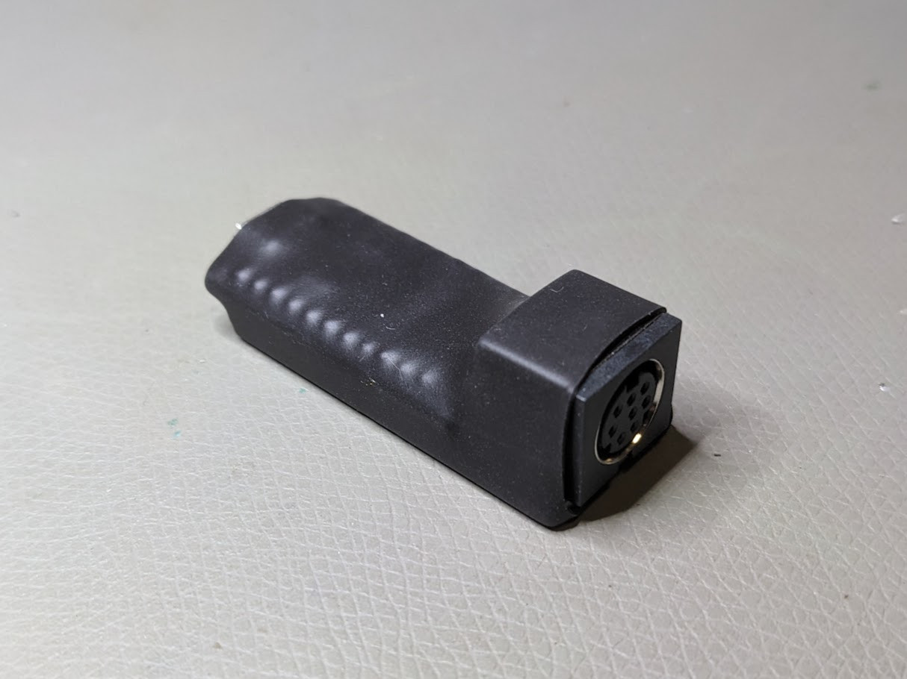

# DaemonBite PC Engine to USB connector PCB

A simple connector / carrier PCB for the [DaemonBite PC Engine to USB converter](https://github.com/MickGyver/DaemonBite-Retro-Controllers-USB/tree/master/PCEngineControllerUSB).
In addition to this board you will need:
- Female MiniDIN-8 THT PCB connector. Note that there are different raster layouts available. This one has to be a two-row 2x4-pin raster, as you can refer from my pictures.
- Arduino Pro Micro (ATMega32U4)

Additional notes:
- Recommended PCB thickness: 1.6mm
- **For JLCPCB**: Set the option 'Remove Order Number' to 'Specify a location' and the order number will be hidden under the MiniDIN connector
- The DaemonBite code is compatible only with 2-button (turbo) pads. Multitaps, 6-button controllers and other special equipment is incompatible at the time of writing.
- Make sure the gamepad count is set to 1 in the Arduino sketch (line 26: '#define GAMEPAD_COUNT 1')

Finished build

I recommend isolating it with shrinking tube
